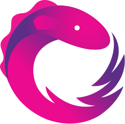

# RiskRoller

This project is used for the time late in a Risk board game when you have 2 large armies going at it and your friends are sitting around watching other people roll dice. This will allow you to quick simulate any battle in Risk the board Game

Live Preview here:
https://risk-roller.mcgillicuddy.dev

## Technology Used

## Development server

This project was generated with [Angular CLI](https://github.com/angular/angular-cli) version 16.2.10.

Run `ng serve` for a dev server. Navigate to `http://localhost:4200/`. The application will automatically reload if you change any of the source files.

## Build

Run `ng build` to build the project. The build artifacts will be stored in the `dist/` directory.

## Running unit tests

Run `ng test` to execute the unit tests via [Karma](https://karma-runner.github.io).

## Deployment

This project uses AWS CDK to deploy onto AWS Cloud and setup the infrastructure. Details are found in cdk folder.

